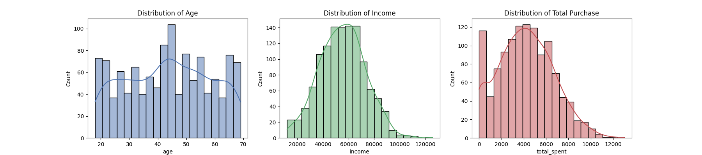
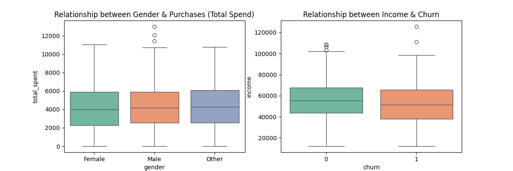
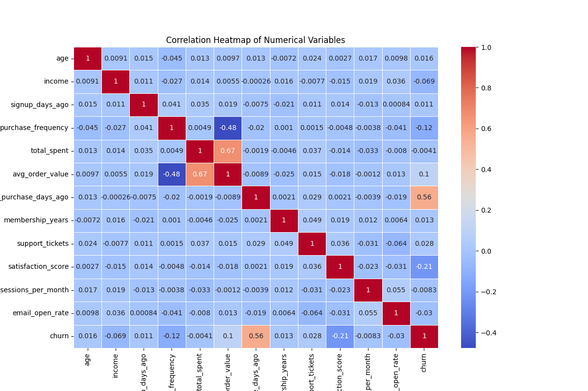
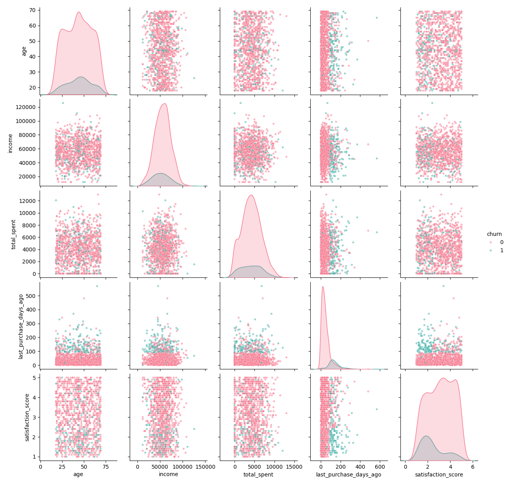

<div align="center">


<a href="https://git.io/typing-svg">
  
</a>

<br/>


</div>


## 📌 Overview

**Data Profiler** is a Data Preprocessing & Feature Engineering project completed as **PR.1** for **Red & White Skill Education**. Working as a Junior Data Analyst for a consumer-insights company, the goal is to take a fragmented, real-world-style **customer purchase behavior** dataset — arriving from **CSV, JSON, a SQL database, and a REST API** — and turn it into a clean, profiled, **ML-ready** dataset for a **customer churn prediction** problem.

> 🎯 **ML Problem Framed:** Predict whether a customer will **churn**, using demographic, purchase, membership, and engagement signals.


## 🗂️ Repository Structure

```text
Data-Profiler-Project/
├── data/
│   ├── customers_demographics.csv         # Source 1 — CSV (demographics)
│   ├── purchase_behavior.json             # Source 2 — JSON (purchase behavior)
│   ├── customers.db                       # Source 3 — SQLite (membership & support)
│   └── engagement_api_response.json       # Source 4 — API-style payload (engagement + churn label)
├── Images/
│   ├── Univariate_Analysis.png            # Age / Income / Total Spend distributions
│   ├── Bivariate_Analysis.png             # Gender vs. Purchases, Income vs. Churn
│   ├── Multivariate_Analysis.png          # Correlation heatmap
│   └── Pair_Plot.png                      # Pair plot by churn class
├── notebooks/
│   └── Data_Profiler_Analysis.ipynb       # Full analysis notebook (Parts A–E, executed)
├── docs/
│   └── Theory_Concepts.pdf                # Theory write-up: data analysis, DS lifecycle, ML framing, tensors
├── reports/
│   └── pandas_profiling_report.html       # Automated data-profiling report (ydata-profiling)
├── requirements.txt
└── README.md
```


## 🧩 Data Sources

| # | Source Type | File | Contents |
|---|---|---|---|
| 1 | CSV | `data/customers_demographics.csv` | `customer_id`, `age`, `gender`, `income`, `region`, `signup_days_ago` |
| 2 | JSON | `data/purchase_behavior.json` | `purchase_frequency`, `total_spent`, `avg_order_value`, `last_purchase_days_ago` |
| 3 | SQL (SQLite) | `data/customers.db` → `customer_membership` table | `membership_years`, `membership_tier`, `support_tickets`, `satisfaction_score` |
| 4 | REST API (payload) | `data/engagement_api_response.json` | `app_sessions_per_month`, `email_open_rate`, `churn` (target) |

All four sources are merged on `customer_id` inside the notebook into a single working table.


## 🛠️ Workflow

### Part A — Fundamentals
- What is Data Analysis
- Planning a Data Science project (CRISP-DM based lifecycle)
- ML problem statement: churn prediction
- Tensors explained in depth, with NumPy examples (scalar → vector → matrix → 3D tensor)

### Part B — Data Acquisition
- Load CSV with Pandas
- Parse JSON
- Connect to SQLite and fetch records
- Parse an API-style JSON response (`{"status", "count", "results": [...]}`)

### Part C — Data Understanding & Cleaning
- `.head()`, `.info()`, `.describe()` exploration
- Missing value & duplicate detection
- Median imputation, dtype correction, duplicate removal

### Part D — Exploratory Data Analysis
- **Univariate:** Age / Income / Total Spend distributions
- **Bivariate:** Gender vs. Purchases, Income vs. Churn
- **Multivariate:** Correlation heatmap, pair plots by churn class

### Part E — Data Profiling
- Automated `ydata-profiling` report — missing values, descriptive stats, correlations, data-quality warnings


## 📊 Exploratory Data Analysis — Visuals

<div align="center">

**Univariate Analysis**


**Bivariate Analysis**


**Multivariate Analysis — Correlation Heatmap**


**Pair Plot by Churn Class**


</div>


## 📈 Key Insights

- `last_purchase_days_ago` and `satisfaction_score` show the clearest separation between churned and retained customers — the strongest behavioral churn signals.
- Total spend is right-skewed; a log transform is recommended before distance-based modeling.
- Income alone is a weak churn predictor — overlap between churned/retained groups is large.
- No severe multicollinearity among numeric features, per the correlation heatmap.


## ⚙️ Getting Started

```bash
git clone https://github.com/RENSEE-GAJIPARA/data-profiler.git
cd data-profiler
pip install -r requirements.txt
jupyter notebook notebooks/Data_Profiler_Analysis.ipynb
```


## 📄 Documentation

- 📘 **Theory write-up (PDF):** [`docs/Theory_Concepts.pdf`](docs/Theory_Concepts.pdf)
- 📈 **Automated profiling report (HTML):** [`reports/pandas_profiling_report.html`](reports/pandas_profiling_report.html)

---

<div align="center">

### ✍️ Author

**Rensee Gajipara**
B.Tech — Artificial Intelligence & Data Science, Sarvajanik College of Engineering & Technology (SCET), Surat

[](https://github.com/RENSEE-GAJIPARA)
[](https://linkedin.com/in/rensee-gajipara/)

<br/>

*"Quality is our Motto."* — Red & White Skill Education, Shaping "skills" for "scaling" higher...!!!


</div>
